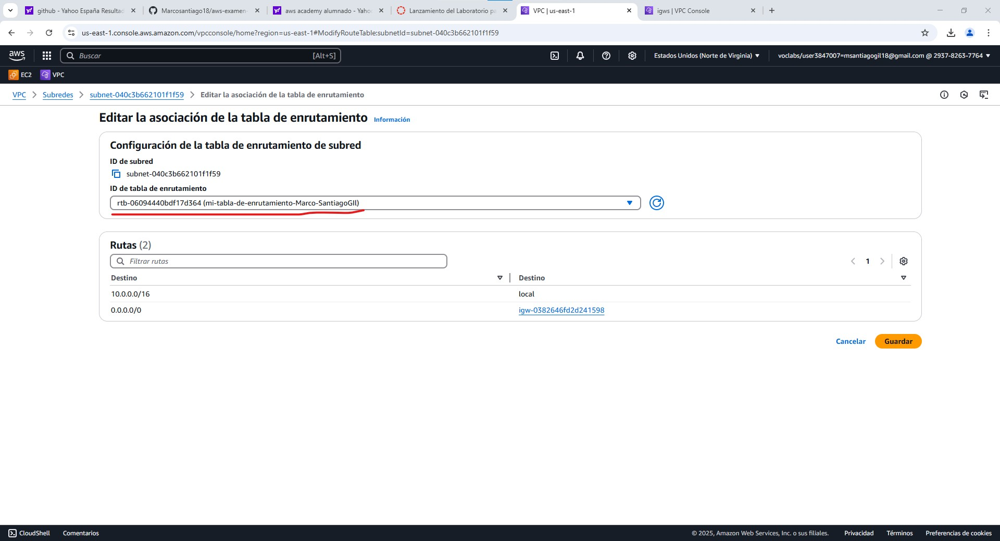
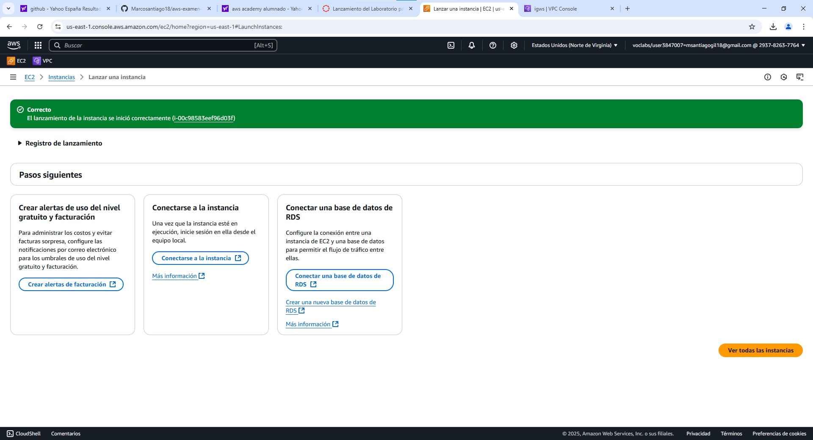

# aws-examen-web-Marco-SantiagoGil

## Paso 1: Crear una VPC

Para crear una nueva VPC nos diregimos a la etiqueta VPC en AWS y le damos a "crear VPC".

Una vez le demos a crear, nos abrira una pestaña para configurar la VPC poniendole el nombre y la dirección ip


Una vez configurado la VPC le damos a "crear VPC"

El siguiente paso es crear las dos subredes, para ello nos vamos a la pestala "Subredes" y le damos a "crear subred"

Empezamos seleccionando la vpc que creamos antes y configurando la primera subred, la subnet-linux, le ponemos el nombre , la zona de disponibilidad y la ip(10.0.1.0/24).


Continuamos configurando la segunda subred , la subnet-windows.


Una vez creadas las subredes debemos crear una puerta de enlace de internet, para ello debemos ir a la pestaña "Puertas de enlace de internet" y darle a "crear gateway de internet".
Le ponemos el nombre y le damos a crear


A continuación debemos asociarla a la vpc anteriormente creada, para ello al crear el gateway nos aparece un mensaje para asociarla.


Clicamos en el mensaje y seleccionamos la vpc ya creada


Ahora tenemos que crear una tabla de enritamiento para el gateway.
Para crearla nos dirigimos a la pestaña "Tablas de enrutamiento" y le damos a crear tabla de enrutamiento.
Una vez dentro deberemos configurar la tabla, le ponemos el nombre y la vpc ya creada


Una vez creada la tabla tenemos que editar las rutas y seleccionar el gateway


Además, debemos asociarle la tabla de enrutamiento a las dos subredes de la siguiente forma.




## Creación de intancias EC2.

 En primer lugar, debemos crear la instancia en la pestaña "EC2" y "lanzar instancia".
 
### 1.Le ponemos el nombre y seleccionamos el sistema operativo
-Linux:


-Windows:

 
### 2.Seleccionamos el tipo de instancia y creamos el par de claves
-Linux:


-Windows:


### 3.Configuramos la red.
-Linux:
En el apartado de configuración de red tenemos que seleccionar la vpc que hemos creado y la subred para la maquina linux (subnet-linux) y asignarle una ip publica a la maquina


-Windows:
En la maquina de windows debemos que seleccionar la subnet-windows y asignarle la ip publica.


Por ultimo lanzamos la instancia.
-Linux:

-Windows:


## Configuración del grupo de seguridad
Una vez creada la instancia debemos seleccionarla en el apartado instancias y seleccionar el apartado seguridad, aqui hacemos clic en el grupo de seguridad.

-linux:


-Windows:


Aqui debemos editar las reglas del grupo de seguridad de entrada con las entradas HTTP(80), Vite(5173), RDP(3389) y ssh(22).

-Linux:


-Windows:


## Intalación y despliege web

### Linux:
En el apartado de instancias, con nuestra instancia linux seleccionada debemos darle a conectar


Cuando la damos a conectar nos da varias opciones. En este caso lo voy a conectar por ssh.
Nos vamos a la pestaña ssh y copiamos el codigo ssh para luego ejecutarlo en git bash 


Una vez ejecutado nos da acceso remoto a la maquina linux.
En esta vamos a proceder a intalar Node.js y npm con los siguinetes comandos.

```bash
    # Actualiza paquetes e instala Node.js y npm
    sudo apt update
    sudo apt install nodejs npm -y
```


Después intalamos Vite y Serve

```bash
    # Instala Vite y Serve
    sudo npm install -g vite serve
```


Tras haber instalado todas las herramientas creamos una carpeta para el proyecto y iniciamos el proyecto.

```bash 
    # Proyecto con Vite
    mkdir web-marco-santiagogil && cd web-marco-santiagogil
    node -v  # para comprobar la version de node
    npm create vite@latest .
    #Debemos selecciona la opcion de "Vanilla" y "JavaScript"

    # despues de crear el proyecto
    npm install
    npm run dev
```


Una vez iniciado el proyecto modificamos el html y el css de este.


### Windows: 


Una vez dentro de la maquina windows debemos ejecutar en powershell los siguientes comandos para intalas Node.js

```bash
    # Instala Node.js (motor JavaScript)
    Set-ExecutionPolicy Bypass -Scope Process -Force
    [System.Net.ServicePointManager]::SecurityProtocol = 'Tls12'
    Invoke-WebRequest -Uri https://nodejs.org/dist/v20.11.0/node-v20.11.0-x64.msi -OutFile node-installer.ms
    Start-Process msiexec.exe -Wait -ArgumentList '/I node-installer.msi /quiet
```
Una vez intalado Node , tenemos que intalar Vite y Serve
```bash
    # Instala Vite y Serve
    npm install -g vite serve
```

Y una vez intalado todo creamos y iniciamos el proyecto

```bash
    # Proyecto con Vite
    mkdir web-marco-santiagogil
    cd web-marco-santiagogil
    npm init vite@latest .
    npm install
    npm run dev
```